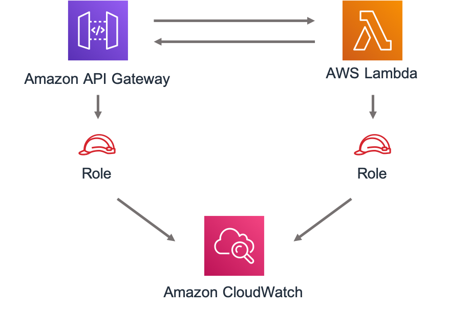
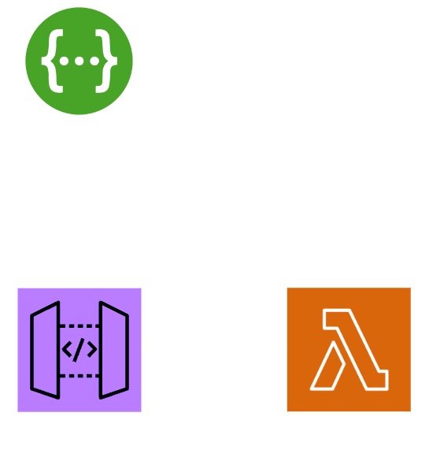

# TL;DR

## Cold start before optimization: 6s

# 1. memorySize

## AWS Lambda Power Tuning

_https://docs.aws.amazon.com/lambda/latest/operatorguide/profile-functions.html_

### Cold start time saved: ?

# 2. snapStart

### Cold start time saved: 3s

_https://docs.aws.amazon.com/lambda/latest/dg/snapstart.html_

# 3. Priming/Dependency initialization

### Cold start time saved: 2s

- https://aws.amazon.com/blogs/compute/reducing-java-cold-starts-on-aws-lambda-functions-with-snapstart/

- https://peixotoo.medium.com/how-to-improve-aws-java-lambda-performance-in-80-84e3432e0327

- https://medium.com/i-love-my-local-farmer-engineering-blog/optimizing-your-java-lambda-cold-starts-and-initializations-5ca24de2c078_

# Result cold start ~1s

## Example using AWS CDK

API Gateway --> Lambda using `SpecRestApi` from aws-cdk-lib/aws-apigateway*

`mvn clean install && npm --prefix cdk/ run cdk synth ApiStack`
- https://docs.aws.amazon.com/cdk/api/v2/docs/aws-cdk-lib.aws_apigateway.SpecRestApi.html
- https://medium.com/@gwieser/solving-a-nightmare-aws-cdk-openapi-and-api-gateway-a1b6fdc1fd24

*`OpenApiGatewayToLambda` from
@aws-solutions-constructs/aws-openapigateway-lambda does have less overhead, but
lacks support to reference a published lambda version (wich is required for Java
Snapstart)

- https://docs.aws.amazon.com/solutions/latest/constructs/aws-openapigateway-lambda.html
- https://github.com/awslabs/aws-solutions-constructs/tree/main/source/patterns/%40aws-solutions-constructs/aws-apigateway-lambda

## Link to this repo:
