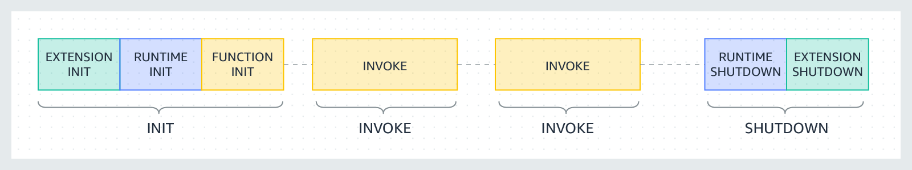

# Running Java on AWS Lambda: learnings and pitfalls

## Cold start before optimization: 6s

### memorySize
Use AWS Lambda Power Tuning to balances speed (duration) and cost.

_https://docs.aws.amazon.com/lambda/latest/operatorguide/profile-functions.html_

#### Cold start time saved: ?

### snapStart
#### Cold start time saved: 3s

_https://docs.aws.amazon.com/lambda/latest/dg/snapstart.html_

### Priming/Dependency initialization
#### Cold start time saved: 2s

- https://aws.amazon.com/blogs/compute/reducing-java-cold-starts-on-aws-lambda-functions-with-snapstart/

- https://peixotoo.medium.com/how-to-improve-aws-java-lambda-performance-in-80-84e3432e0327

- https://medium.com/i-love-my-local-farmer-engineering-blog/optimizing-your-java-lambda-cold-starts-and-initializations-5ca24de2c078_

## AWS CDK

API Gateway --> Lambda using 
`OpenApiGatewayToLambda` from @aws-solutions-constructs/aws-openapigateway-lambda

https://github.com/awslabs/aws-solutions-constructs/tree/main/source/patterns/%40aws-solutions-constructs/aws-apigateway-lambda
